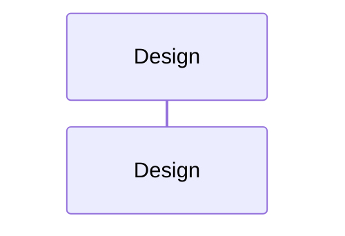

I've been working on a custom Azure DevOps Server extension task that I'm writing in Typescript and using [Jest](https://jestjs.io/) to write unit tests for my code. I've found that Jest is a great tool for writing unit tests for Typescript and Javascript projects. It's easy to use and has a lot of great features. Here I'll cover how unit tests have fit into my development process for this task, and how I've been using Jest to write them.

# Development Workflow

Unit tests test logical units of code in isolation. This means that they should not depend on any external resources such as databases or web services. This is important because it means that unit tests can be run in isolation without any external dependencies. This makes them fast and easy to run. This also means that unit tests are not a good way to test the integration of multiple units of code. For this you would want to use integration tests.

Test driven development (TDD) is a development process where you write unit tests before you write the code that they test. This is a great way to make sure that your code is testable and that you're writing code that does what you expect it to do. The basic process is as follows:

